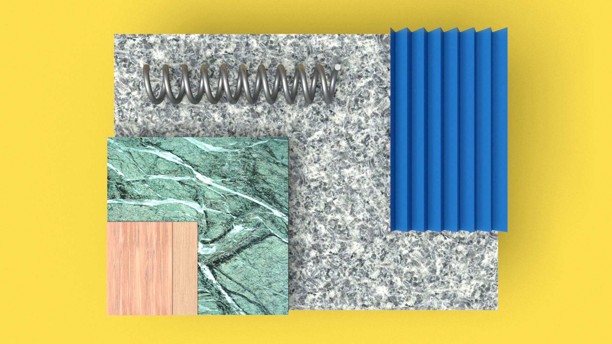

<?xml version="1.0" encoding="utf-8"?>
<!-- Generator: Adobe Illustrator 26.0.2, SVG Export Plug-In . SVG Version: 6.00 Build 0)  -->
<svg version="1.1" xmlns="http://www.w3.org/2000/svg" xmlns:xlink="http://www.w3.org/1999/xlink" x="0px" y="0px"
	 viewBox="0 0 1366 768" style="enable-background:new 0 0 1366 768;" xml:space="preserve">

<g id="Oval">
	<g>
		<ellipse class="st0" cx="386.54" cy="303" rx="185.31" ry="89.79"/>
		<path d="M386.54,213.42c102.06,0,185.1,40.19,185.1,89.58s-83.03,89.58-185.1,89.58S201.44,352.4,201.44,303
			S284.48,213.42,386.54,213.42 M386.54,213c-102.46,0-185.52,40.29-185.52,90s83.06,90,185.52,90s185.52-40.29,185.52-90
			S489,213,386.54,213L386.54,213z"/>
	</g>
</g>
<g id="Lines">
	<g>
		<g>
			<g>
				<path d="M1090.15,215.07c-16.68,21.66-37.2,40.34-60.3,54.97c-11.58,7.34-23.81,13.73-36.52,18.87
					c-7.12,2.88-14.57,5.21-22.35,4.41c-7.7-0.8-14.91-4.04-21.88-7.21c-28.68-13.06-57.52-25.77-86.7-37.66
					c-29.44-11.99-59.21-23.17-89.42-33.09c-29.34-9.64-60.29-19.98-91.62-17.42c-3.69,0.3-7.36,0.8-11,1.46
					c-1.9,0.34-1.09,3.24,0.8,2.89c31.77-5.77,63.72,3.96,93.72,13.59c30.52,9.8,60.61,20.91,90.35,32.89
					c29.88,12.03,59.4,24.94,88.72,38.29c6.85,3.12,13.72,6.5,21.07,8.26c7.2,1.73,14.37,1.36,21.45-0.76
					c6.82-2.04,13.41-5.06,19.83-8.11c6.13-2.91,12.13-6.08,17.98-9.51c23.51-13.77,44.69-31.6,62.17-52.51
					c2.15-2.57,4.23-5.19,6.27-7.84C1093.92,215.05,1091.32,213.56,1090.15,215.07L1090.15,215.07z"/>
			</g>
		</g>
		<g>
			<g>
				<path d="M1146.78,372.51c1.35,8.4-5.88,14.94-12.46,18.71c-3.97,2.28-8.29,3.81-12.66,5.13c-4.79,1.45-9.69,2.56-14.64,3.33
					c-20.19,3.16-40.89,0.62-60.59-4.29c-20.27-5.05-39.72-12.71-58.97-20.71c-19.65-8.16-39.33-16.43-59.8-22.33
					c-19.83-5.71-40.59-9.14-61.25-7.28c-2.6,0.23-5.19,0.56-7.77,0.94c-1.9,0.28-1.09,3.18,0.8,2.89
					c21.22-3.17,42.74-0.37,63.31,5.19c20.91,5.65,40.97,13.96,60.94,22.25c19.69,8.17,39.48,16.16,60.16,21.49
					c19.93,5.13,40.79,7.88,61.31,5.13c9.64-1.29,19.66-3.57,28.41-7.94c6.98-3.48,14.55-9.34,16.08-17.47
					c0.37-1.96,0.34-3.88,0.02-5.84C1149.37,369.82,1146.48,370.62,1146.78,372.51L1146.78,372.51z"/>
			</g>
		</g>
	</g>
</g>
</svg>
