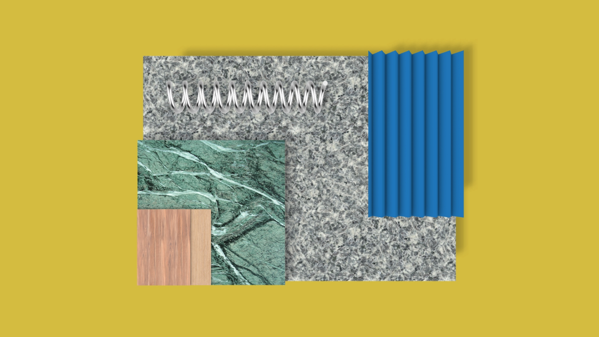

<?xml version="1.0" encoding="utf-8"?>
<!-- Generator: Adobe Illustrator 26.0.2, SVG Export Plug-In . SVG Version: 6.00 Build 0)  -->
<svg version="1.1" xmlns="http://www.w3.org/2000/svg" xmlns:xlink="http://www.w3.org/1999/xlink" x="0px" y="0px"
	 viewBox="0 0 1366 768" style="enable-background:new 0 0 1366 768;" xml:space="preserve">

<g id="Oval">
	<g>
		<ellipse class="st0" cx="386.54" cy="303" rx="185.31" ry="89.79"/>
		<path d="M386.54,213.42c102.06,0,185.1,40.19,185.1,89.58s-83.03,89.58-185.1,89.58S201.44,352.4,201.44,303
			S284.48,213.42,386.54,213.42 M386.54,213c-102.46,0-185.52,40.29-185.52,90s83.06,90,185.52,90s185.52-40.29,185.52-90
			S489,213,386.54,213L386.54,213z"/>
	</g>
</g>
<g id="Lines">
	<line class="st1" x1="665.44" y1="213" x2="665.44" y2="393"/>
</g>
</svg>
